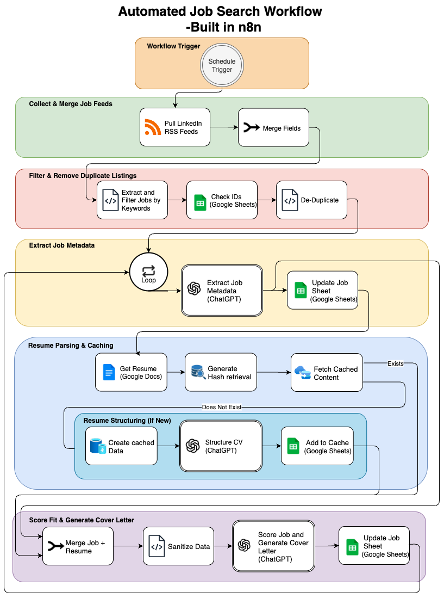
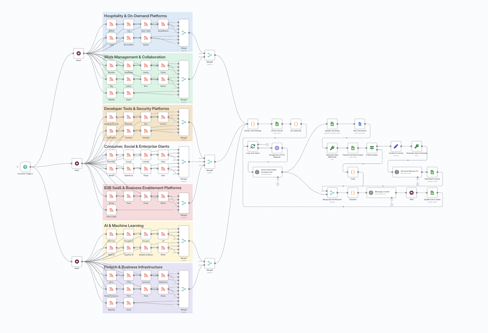

# Automated Job Search Workflow (n8n + OpenAI + Google Sheets)
**Version 3 — Rebuilt for Precision Scoring and True Job-Fit Assessment**

<picture>
  
</picture>
<strong>Notion Walkthrough:</strong>
Explore the full breakdown of this project across v1 → v3 with diagrams, screenshots, notes, metrics, and lessons learned:

👉 [View my full project in Notion](https://working-knuckle-420.notion.site/n8n-Job-Search-Assistant-248b1441915d8047a5a6d67c81a91ddc)

## Overview
This workflow automates the sourcing, filtering, enrichment, and ranking of job postings in San Francisco’s tech sector. It specifically targets business operations, product operations, and project coordination roles that align with my transferable experience.

Originally built to support my transition from high-performance kitchen operations into tech, the system now includes a revamped ranking model. Instead of just skill overlap, it focuses on real-world hiring likelihood. It prioritizes roles that reflect both my strengths and viable entry points—helping surface fewer, higher-value opportunities and reduce time spent on low-fit applications
> ⚠️ **This is a redacted version.** Personal document links, API credentials, and private RSS feeds have been removed for security.

### 🔧 The system:
1. **Collects** postings from targeted RSS feeds for selected tech companies.  
2. **Filters** irrelevant and senior-level roles before processing.  
3. **Deduplicates** jobs already logged in Google Sheets.  
4. **Enriches** job data with company metadata, keywords, and technical/functional skill extraction using GPT.  
5. **Parses** my resume into structured JSON for skill-matching.  
6. **Scores** job fit on a custom 1–5 scale designed for my industry pivot.  
7. **Generates** tailored, ATS-friendly cover letters.  
8. **Updates** a Google Sheet with clean, consistent job records.  

---
## 🐣 Project Evolution

| Version  | Focus                           | Key Improvements |
|----------|----------------------------------|------------------|
| **🥚 v1** | Initial Automation               | - Basic RSS feed ingestion    - Simple filtering and skill matching   - Resume parsed via HTTP    - Basic Google Sheets logging |
| **🐥 v2** | Enhanced Data & Reliability      | - Switched to Google Docs API for cleaner resume data   - Improved job metadata extraction   - Expanded filtering logic to reduce noise   - Upgraded to 1–5+ ranking system |
| **🐓 v3** | Precision Scoring (Current)      | - Fully redesigned ranking logic   - Focused on *likelihood of success* over raw skill match   - Simplified back to 1–5 scale   - Filtered out high-skill but low-fit roles |

---
## 🧰 Tech Stack
- **n8n** — workflow automation  
- **RSS Feeds** — company job listings  
- **OpenAI API** — data extraction, enrichment, and cover letter generation  
- **Google Sheets API** — logging and tracking job applications  
- **Google Docs API** — direct resume retrieval  
- **JavaScript** — custom filtering, caching, and data transformation  

---

## 📐 Workflow Architecture

[RSS Feeds]
→ [Initial Role & Seniority Filtering]
→ [Deduplication by Job ID]
→ [Collect Job Data + Metadata]
→ [Resume Retrieval via Google Docs API]
→ [Precision Fit Scoring]
→ [Cover Letter Generation]
→ [Google Sheets Update]

---

## 🖼️ Visual Overview

### 🔹 Detailed Workflow Diagram  
A high-level, color-coded breakdown of the full automation flow:

---

### 🔹 Real Workflow from n8n  
Here’s the live view from my n8n instance, showing the full node structure:

---

## 📚 Lessons Learned
- Stronger **front-end filtering** saves time, tokens, and cleanup.  
- Direct API connections (Google Docs) are more reliable than scraping.  
- A clean caching system improves stability and efficiency.  
- Ranking logic must be **customized to your pivot**.
- **Career pivot scoring** requires different logic than traditional skill matching.

---

## 🚀 How to Run Locally
> ⚠️ **This repo contains multiple versions of the workflow.** For the most recent and recommended setup, use n8n Job_Search_Automation_v3.json. Version 1, and 2 are included for historical reference.
1. Clone this repo.  
2. Import `Job_Search_Automation_v3.json` into n8n.  
3. Add environment variables:  
   - `OPENAI_API_KEY`  
   - Google API credentials for **Sheets** and **Docs**  
4. Replace RSS feed URLs with your own target company feeds.  
5. Trigger manually or schedule daily runs.  

---

## 📊 Example Output

| Title                         | Company Name | Location           | Score | Link | Cover Letter            |
|--------------------------------|--------------|--------------------|-------|------|-------------------------|
| Product Operations Coordinator | Airtable     | San Francisco, CA  | 3    | View | Generated, ATS-ready    |

---

## ➡️ Next Steps
- Integrate Slack/Email alerts for high-scoring roles.
