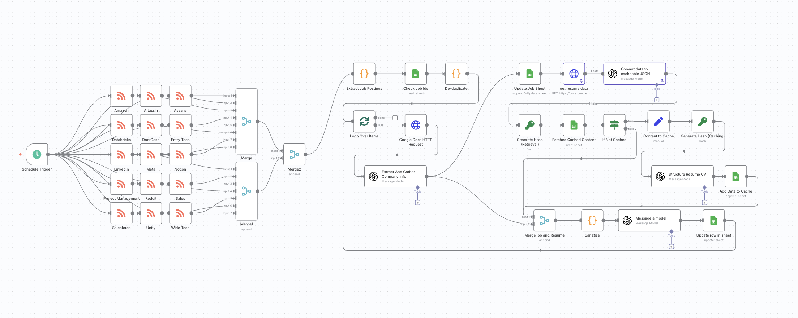

# Automated Job Search Workflow (n8n + OpenAI + Google Sheets)

**Version 2.0 — Rebuilt for Accuracy, Efficiency, and Skill Alignment**

## Overview
This workflow automates the sourcing, filtering, ranking, and enrichment of job postings in **San Francisco’s tech sector**, specifically targeting **business operations**, **product operations**, **project coordination**, and **revenue operations** roles aligned with my skill set.
> ⚠️ **This is a redacted version.** Personal document links, API credentials, and private RSS feeds have been removed for security.

### 🔧 The system:
1. **Collects** postings from targeted RSS feeds for selected tech companies.  
2. **Filters** irrelevant and senior-level roles before processing.  
3. **Deduplicates** jobs already logged in Google Sheets.  
4. **Enriches** job data with company metadata, keywords, and technical/functional skill extraction using GPT.  
5. **Parses** my resume into structured JSON for skill-matching.  
6. **Scores** job fit on a custom 1–5+ scale designed for my industry pivot.  
7. **Generates** tailored, ATS-friendly cover letters.  
8. **Updates** a Google Sheet with clean, consistent job records.  

---

## 🧰 Tech Stack
- **n8n** — workflow automation  
- **RSS Feeds** — company job listings  
- **OpenAI API** — data extraction, enrichment, and cover letter generation  
- **Google Sheets API** — logging and tracking job applications  
- **Google Docs API** — direct resume retrieval  
- **JavaScript** — custom filtering, caching, and data transformation  

---

## 📐 Workflow Architecture

[RSS Feeds]
→ [Initial Role & Seniority Filtering]
→ [Deduplication by Job ID]
→ [Collect Job Data + Metadata]
→ [Resume Retrieval via Google Docs API]
→ [Skill Match Scoring]
→ [Cover Letter Generation]
→ [Google Sheets Update]

---

## 🖼️ Visual Overview

### 🔹 Detailed Workflow Diagram  
A high-level, color-coded breakdown of the full automation flow:

---

### 🔹 Real Workflow from n8n  
Here’s the live view from my n8n instance, showing the full node structure:

---

## 🛠️ Key Improvements in v2.0

### 1. Improved Job Data Collection
- Expanded extracted fields to include role descriptions, functional keywords, technical skills, and richer company metadata.

### 2. Updated Ranking System for Skill Alignment
- Rebuilt the scoring logic to weight technical overlaps and domain fit more heavily, ensuring high scores only go to truly relevant roles.

### 3. Switched Resume Retrieval to Google Docs API
- Direct API retrieval for cleaner parsing, replacing HTML pulls from the public link.

### 4. Cache Formatting Validation
- Code node added to normalize cached data before reprocessing, preventing workflow errors.

### 5. Enhanced Initial Filtering
- Regex filters expanded to exclude senior, management, and irrelevant roles to reduce token usage and keep Sheets clean.

---

## 📚 Lessons Learned
- Stronger **front-end filtering** saves time, tokens, and cleanup.  
- Direct API connections (Google Docs) are more reliable than scraping.  
- A clean caching system improves stability and efficiency.  
- Ranking logic must be **customized to your pivot**.  

---

## 🚀How to Run Locally
1. Clone this repo.  
2. Import `job_automation_sanitized.json` into n8n.  
3. Add environment variables:  
   - `OPENAI_API_KEY`  
   - Google API credentials for **Sheets** and **Docs**  
4. Replace RSS feed URLs with your own target company feeds.  
5. Trigger manually or schedule daily runs.  

---

## 📊 Example Output

| Title                         | Company Name | Location           | Score | Link | Cover Letter            |
|--------------------------------|--------------|--------------------|-------|------|-------------------------|
| Product Operations Coordinator | Airtable     | San Francisco, CA  | 3+    | View | Generated, ATS-ready    |

---

## ➡️ Next Steps
- Integrate Slack/Email alerts for high-scoring roles.
